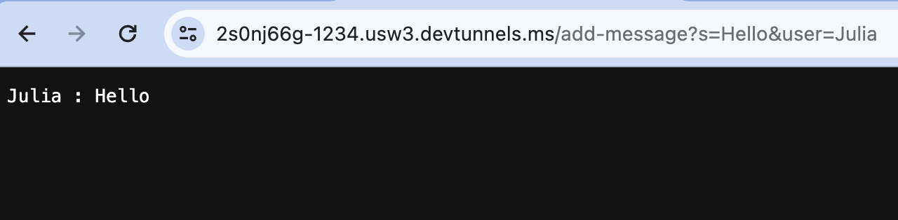
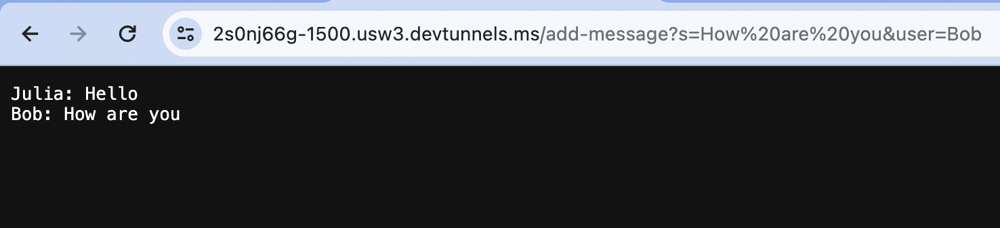
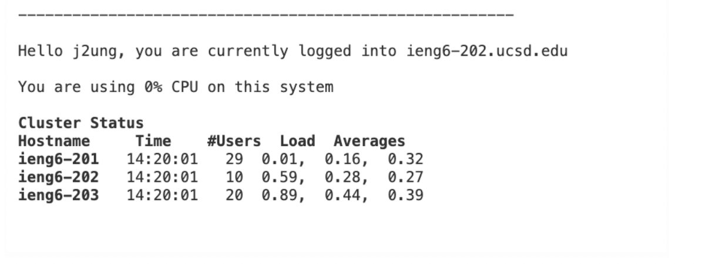

# Lab 2 - Servers and SSH Keys

## Part 1 - Chat Server

`ChatServer.java`

```
{
import java.io.IOException;
import java.net.URI;

class Handler implements URLHandler{
    String line = "";   
    public String handleRequest(URI url) {
        if (url.getPath().equals("/add-message")) {
            String[] parameters = url.getQuery().split("&");
            String[] message = parameters[0].split("=");
            String[] name = parameters[1].split("=");
            if(name[0].equals("user") && message[0].equals("s")) {
                String test = String.format("%s : %s", name[1], message[1]);
                line += test + "\n";
            }
            return line;
        }
        else {
            return line;
        }
    }
}
class ChatServer {
    public static void main(String[] args) throws IOException {
        if(args.length == 0){
            System.out.println("Missing port number! Try any number between 1024 to 49151");
            return;
        }
        int port = Integer.parseInt(args[0]);
        Server.start(port, new Handler());
    }
}
}
```

    * When ``/add-message?s=Hello&user=Julia`` is used, it calls the ``handleRequest()`` method. By splitting the &'s and ='s, it separates the arguement and returns the user's name and the message. In my case, the name is Julia and the message is "Hello".

    

    * When ``/add-message?s=How%20are%20you&user=Bob`` is used after the first argument, it saves the previous line and outputs the new argument in the next line. Like the previous one, it calls ``handleRequest()``. After typing "How are you" in the URL, the URL replaces the spaces as "%20", but outputs the message as "Bob: How are you". This argument still functions because the code separates by &'s and ='s.

## Part 2 - `ls` of Chat Server
    1) Path to Private Key

    
    2) Path to Public Key    
    

    
    3)``ieng`` Account
    

    

## Part 3 - Reflection

In lab 2 and 3, I learned how to remotely connect to servers. I was able to use Java's built-in classes to build and run web servers. I began to understand the purpose of paths and the reason behind every interaction I had.

