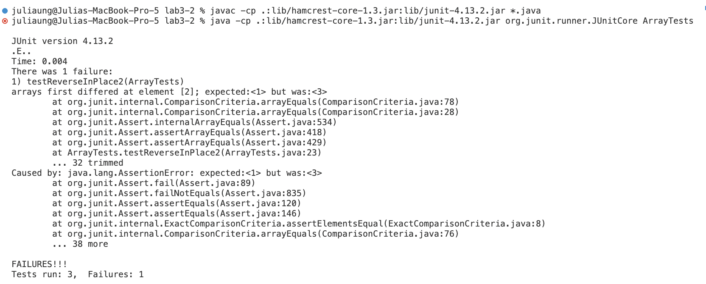
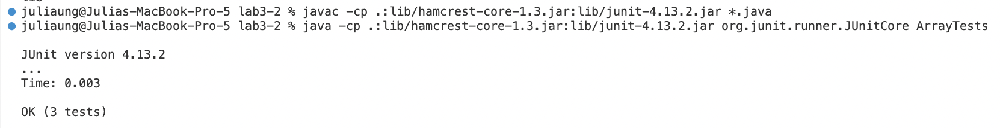

## Lab 3 - Bugs and Commands

# Bugs
1. Failure Inducing Input With `reverseInPlace` 
```
@Test 
  public void testReverseInPlace2() {
    int[] customInput2 = {1, 2, 3};
    ArrayExamples.reverseInPlace(customInput2);
    assertArrayEquals(new int[]{3, 2, 1}, customInput2);
    }
```
  
2. Failure Not From Inducing Input With `reverseInPlace`
```
@Test
public void testReverseInPlace3() {
    int[] customInput3 = {1};
    ArrayExamples.reverseInPlace(customInput3);
    assertArrayEquals(new int[]{1}, customInput3);
}
```
3. The Symptom
  

4. The Bug Before And After Code Change
  


# Researching Commands
