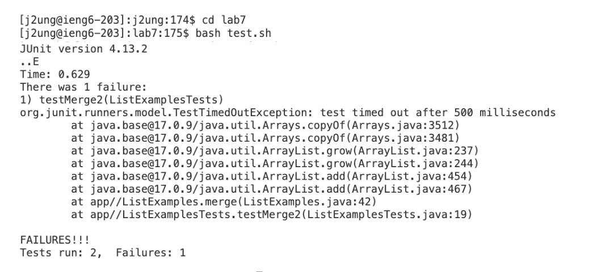
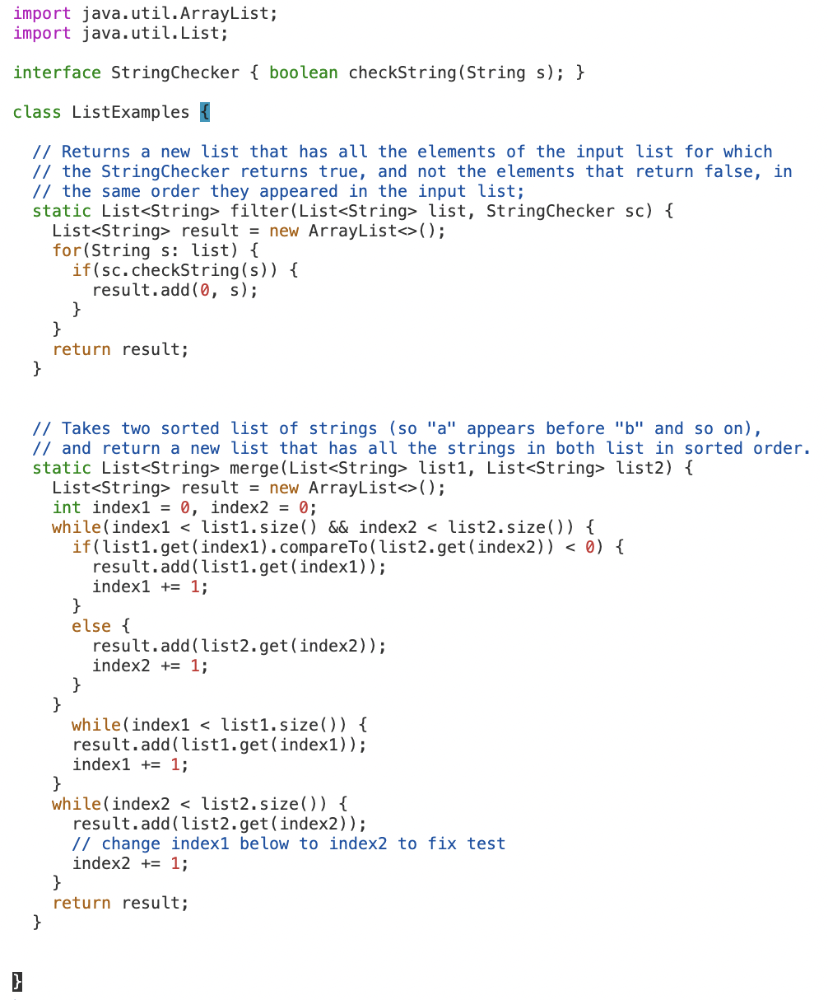

# Lab Report 4 - Vim

## Step 4 - Log into ieng6

Keys Pressed: `ssh <Space> j2ung@ieng6.ucsd.edu <Enter>`

Explanation:
* I logged in with `ssh j2ung@ieng6.ucsd.edu` and did not need a password.

## Step 5 - Clone your fork of the repository from your Github account (using the SSH URL)

Keys Pressed: 
`git <Space> clone <Command+V> <Enter>`

Explanation:
* I first forked lab 7 repository and copied the `SSH` URL. Since I saved the `SSH` on my github, I was able to git clone with the `SSH` URL. With `git clone`, it will clone the URL to my ieng6.

## Step 6 - Run the tests, demonstrating that they fail

Keys Pressed: 
`cd lab7 <Enter>` 
`bash test.sh <Enter>`

Explanation:
* I had to switch to the lab7 directory then run the `test.sh` using bash. This shows the errors in the code.

## Step 7 - Edit the code file to fix the failing test

Keys Pressed: 
`vim ListExamples.java <Enter> </> index1 <Enter>` 
`<n> <n> <n> <n> <n> <n> <n> <n> <x> <i> 2 <Esc> <:wq> <enter>`

Explanation:
* 

## Step 8 - Run the tests, demonstrating that they now succeed

Keys Pressed: 
` bash test.sh <Enter>`

Explanation:
* 

## Step 9 - Commit and push the resulting change to your Github account (you can pick any commit message!)

Keys Pressed: 
`git add ListExamples.java <Enter>` 
`git commit -m "fix bugs" <Enter>` 
`git push <Enter>`

Explanation:
* 

