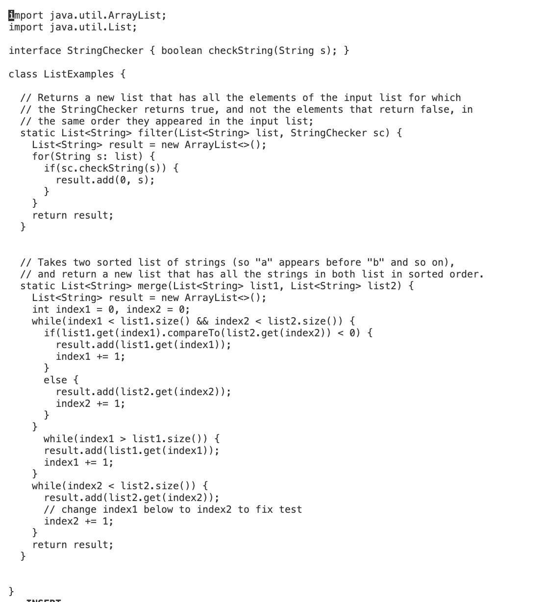

# Lab 5 - Putting it All Together

## Part 1 - Debugging Scenario
```
Student:

Hello, I am having trouble with my code. Here is the error I am getting:
```

```
I am trying to make a filter and merge method. I want it the filter to return a new list containing
the filtered strings while preserving their original order. As for the merge, I want it to take two
sorted lists of strings and merges them into a single list while maintaining sorted order. Here is
my code:
```


-------


```
TA:

Hi there! According to the test, the failure occurred because the expected array and the actual array
have different lengths. This error must be from the merge method. To resolve this issue, you may need
to relook at the implementation of the merge method in the ListExamples class to so it can correctly
merges two sorted lists of strings and returns an array of the expected length with the correct
elements in sorted order. Let me know how it turns out!
```
--------


```
Student:

Okay, I rechecked my merge method. I realized my error resided in this method. I understand now that
the bug occurs when handling the remaining elements of the input lists after the merge process. It
fails to properly handle cases where one of the input lists has remaining elements while the other is
already fully merged. As a result, the ArrayIndexOutOfBoundsException is thrown. Specifically, line 37.
I changed it ">" to "<" which perfectly fixed the code. Thank you! Here are my results:
```


# The file & directory structure needed

  ```
  |-Lab 7/
  |
  |--libs/
  |   |
  |   |--hamcrest-2.2.jar
  |   |--junit-4.13.2.jar
  |
  |--ListExamples.java
  |--TestListExamples.java
  |--test.sh

  ```
The contents of each file before fixing the bug
   * ListExamples.java
     ```
     import java.util.ArrayList;
     import java.util.List;
     
     interface StringChecker { boolean checkString(String s); }
     
     class ListExamples {
     
       // Returns a new list that has all the elements of the input list for which
       // the StringChecker returns true, and not the elements that return false, in
       // the same order they appeared in the input list;
       static List<String> filter(List<String> list, StringChecker sc) {
         List<String> result = new ArrayList<>();
         for(String s: list) {
           if(sc.checkString(s)) {
             result.add(0, s);
           }
         }
         return result;
       }
     
     
       // Takes two sorted list of strings (so "a" appears before "b" and so on),
       // and return a new list that has all the strings in both list in sorted order.
       static List<String> merge(List<String> list1, List<String> list2) {
         List<String> result = new ArrayList<>();
         int index1 = 0, index2 = 0;
         while(index1 < list1.size() && index2 < list2.size()) {
           if(list1.get(index1).compareTo(list2.get(index2)) < 0) {
             result.add(list1.get(index1));
             index1 += 1;
           }
           else {
             result.add(list2.get(index2));
             index2 += 1;
           }
         }
         while(index1 > list1.size()) {
           result.add(list1.get(index1));
           index1 += 1;
         }
         while(index2 < list2.size()) {
           result.add(list2.get(index2));
           index2 += 1;
         }
         return result;
       }
     
     
     }
     
     ```
     
   * TestListExamples.java
     ```
     import static org.junit.Assert.*;
     import org.junit.*;
     import java.util.*;
     import java.util.ArrayList;
     
     
     public class ListExamplesTests {
     	@Test(timeout = 500)
     	public void testMerge1() {
         		List<String> l1 = new ArrayList<String>(Arrays.asList("x", "y"));
     		List<String> l2 = new ArrayList<String>(Arrays.asList("a", "b"));
     		assertArrayEquals(new String[]{ "a", "b", "x", "y"}, ListExamples.merge(l1, l2).toArray());
     	}
     	
     	@Test(timeout = 500)
             public void testMerge2() {
     		List<String> l1 = new ArrayList<String>(Arrays.asList("a", "b", "c"));
     		List<String> l2 = new ArrayList<String>(Arrays.asList("c", "d", "e"));
     		assertArrayEquals(new String[]{ "a", "b", "c", "c", "d", "e" }, ListExamples.merge(l1, l2).toArray());
             }
     
     }
     
     ```
     
   * test.sh
     ```
     javac -cp .:lib/hamcrest-core-1.3.jar:lib/junit-4.13.2.jar *.java
     java -cp .:lib/hamcrest-core-1.3.jar:lib/junit-4.13.2.jar org.junit.runner.JUnitCore ListExamplesTests
     ```
The full command line (or lines) you ran to trigger the bug
   * While in the lab 7 directory, I ran `bash test.sh` to test the code.
  
A description of what to edit to fix the bug
   *  As for fixing it, I used `vim ListExamples.java` to access the code. In order to change the code, I used `i` key to insert new code. I changed `>` to `<`. I reran `bash test.sh` to check if it passed and it did.

## Part 2 - Reflection  
  * One of the things I learned during the last half of the quarter, was the basics of `vim`. Before, I knew nothiing of `vim`. Now, I know a few things like `i` to edit, `:wq`to save changes, and `:q!` to quit without changes. I also learned how to commit and push changes onto Git repositiories. It makes collabortive coding more organized and efficient. Overall, I think this course was highly educational for me because I was able to learn more when interacting with other students during lab and the coursework itself. 
